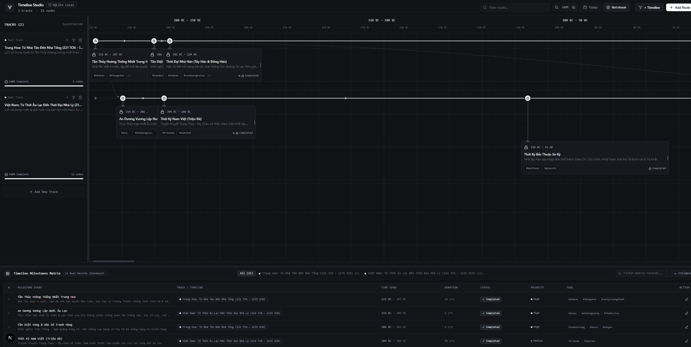

# Timeline Studio

[](LICENSE)
[](https://github.com/hoangtran1411/timeline-studio/actions/workflows/ci.yml)
[](https://nextjs.org/)
[](https://react.dev/)
[](https://www.typescriptlang.org/)
[](https://tailwindcss.com/)

> **A high-precision, soft-contrast monochrome timeline and roadmap studio inspired by engineering quad-ruled notebooks.**



---

## Table of Contents

- [Design Philosophy](#-design-philosophy-engineering-tactile-minimalism)
- [Features](#-features)
- [Visual Architecture](#️-visual-architecture--terminology)
- [Tech Stack](#️-tech-stack)
- [Getting Started](#-getting-started)
- [Available Scripts](#-available-scripts)
- [Project Structure](#-project-structure)
- [Contributing](#-contributing)
- [License](#-license)

---

## 🧭 Design Philosophy: "Engineering Tactile Minimalism"

Modern planning tools are often cluttered with neon accents, noisy gradients, and distracting animations. **Timeline Studio** takes a different path:

1. **Anti-AI Slop**: No aggressive saturated glows, neon meshes, or distracting glassmorphism.
2. **Soft-Contrast Monochrome**: High-contrast pure white on pure black causes eye strain. We use a warm charcoal foundation (`#101114`) with zinc accents and soft off-white text (`#ececf0`) engineered for extended planning sessions.
3. **Tactile Notebook Structure**: The canvas background features a subtle graph-paper quad grid reminiscent of physical laboratory and engineering notebooks (Rhodia, Kokuyo Campus, Leuchtturm1917).
4. **Lean Database Philosophy**: Domain information (dates, titles, dependencies) is stored in SQLite, while all UI sizing preferences (dock widths, drawer sizes, panel heights) are kept in browser `localStorage`.

---

## ✨ Features

- **Clothesline Visual Drafting Model**:
  - Horizontal **Track Wires** with **Knot Pegs** clamped on the line.
  - Technical drafting **Hanger Stems** suspending milestone cards in collision-avoidance sub-lanes.
  - Connection lines stop cleanly at knot perimeters without slicing through knot centers.
- **Milestone Security Lock**:
  - Completed milestones are **locked by default** against accidental dragging.
  - Interactive padlock button (`Lock` / `Unlock`) toggles dragging permissions.
  - Visual lock badge appears in the knot peg and card header.
- **Timeline Branching & Dependency Curves**:
  - Branch child timelines directly from any milestone with smooth cubic Bézier splines.
  - Cross-track dependency lines (`blocks`, `relates_to`) with synchronized opacity.
- **Deep Historical Date Range Support**:
  - Supports dates across millennia, centuries, and eras from ancient antiquity (e.g. 221 BC) to modern times.
  - Dynamic Time Ruler adapts scale ticks across Millennia, Centuries, Decades, Years, Months, and Days.
- **Resizable Workspaces (Persistent in `localStorage`)**:
  - **Left Track Dock**: Drag to resize sidebar width (`220px` – `560px`).
  - **Node Drawer**: Slide-over inspector with left-edge splitter (`360px` – `1100px`).
  - **Bottom Matrix Panel**: Spreadsheet-like comparison panel with drag-to-resize height and double-click collapse.
  - **Timeline Node Card**: Right-edge handle to adjust individual card width on the canvas.
- **Live Database-Driven Comparative Matrix**:
  - Bottom panel displays 100% real SQLite records.
  - Chronological alignment of parallel historical events.
  - Real-time search by title, description, or `#tag`.
  - Filter tabs for individual tracks or combined overview.

---

## 🗺️ Visual Architecture & Terminology

For a full reference of UI terms, component files, and layout diagrams, see [`keyword.md`](keyword.md).

```text
┌────────────────────────────────────────────────────────────────────────────────────────┐
│  [Top Toolbar] Brand • Search Filter • Zoom In/Out • Grid Style • + New Timeline       │
├───────────────────┬────────────────────────────────────────────────────────────────────┤
│                   │  [Time Ruler] Millennia / Centuries / Decades / Months / Days      │
│                   │               ▲ [Today Scrubber / Indicator]                       │
│                   ├────────────────────────────────────────────────────────────────────┤
│  [Left Track Dock]│  [Chrono Canvas] (Notebook Quad Grid Canvas)                       │
│                   │                                                                    │
│  • Track Card     │   ══════●═════════════════════●═════════ [Track Wire / Branch Line]│
│    - Title        │         │ [Hanger Stem]       │                                    │
│    - Milestone #  │      ┌──┴──────────┐       ┌──┴──────────┐                         │
│    - Color pill   │      │ [Node Card] │───┐   │ [Node Card] │ [Duration Handle]       │
│    - Actions      │      │ • Status    │   │   │ • Lock Icon │                         │
│                   │      └─────────────┘   ▼   └─────────────┘                         │
│                   │       [Dependency Dotted Line / Curve]                             │
│                   │                                                                    │
│  [Dock Splitter]  │  [Canvas Scrollbar]                                                │
├───────────────────┴────────────────────────────────────────────────────────────────────┤
│  === [Bottom Splitter / Resize Handle] =============================================== │
├────────────────────────────────────────────────────────────────────────────────────────┤
│  [Bottom Matrix Panel] Track Tabs • Milestones Matrix Table • Tags Filter              │
└────────────────────────────────────────────────────────────────────────────────────────┘
```

---

## 🛠️ Tech Stack

| Category | Technology |
| :--- | :--- |
| **Framework** | [Next.js 16](https://nextjs.org) (App Router, Server Actions, Client Components) |
| **UI & State** | [React 19](https://react.dev), Tailwind CSS v4, Lucide React |
| **Database** | Built-in [Node.js SQLite](https://nodejs.org/api/sqlite.html) (`node:sqlite`) |
| **Language** | [TypeScript 5](https://www.typescriptlang.org) |
| **Code Quality** | ESLint, Markdownlint |
| **CI/CD** | GitHub Actions |

---

## 🚀 Getting Started

### Prerequisites

- **Node.js**: v22.x or later (Node.js 24 LTS recommended for built-in SQLite)
- **npm**: v10+

### Installation

1. **Clone the repository**:

   ```bash
   git clone https://github.com/hoangtran1411/timeline-studio.git
   cd timeline-studio
   ```

2. **Install dependencies**:

   ```bash
   npm install
   ```

3. **Run the development server**:

   ```bash
   npm run dev
   ```

4. Open [http://localhost:3000](http://localhost:3000) in your browser.

---

## 📜 Available Scripts

| Script | Description |
| :--- | :--- |
| `npm run dev` | Starts the Next.js local development server with Turbopack. |
| `npm run build` | Compiles and builds the production application. |
| `npm run start` | Starts the production server. |
| `npm run lint` | Runs ESLint to check for code quality and syntax issues. |
| `npm run lint:md` | Runs `markdownlint` to verify all markdown documents. |
| `npx tsc --noEmit` | Runs TypeScript compiler in type-check mode. |

---

## 📁 Project Structure

```text
timeline-studio/
├── .github/workflows/   # GitHub Actions CI pipeline
├── public/               # Static assets
├── src/
│   ├── app/              # Next.js App Router (pages, layouts, API routes)
│   │   └── api/          # REST API routes (timeline, nodes)
│   ├── components/       # React client components
│   ├── lib/              # Database layer & services
│   ├── types/            # TypeScript type definitions
│   └── utils/            # Utility functions (date helpers, etc.)
├── data/                 # SQLite database files
├── CONTRIBUTING.md       # Contribution guidelines
├── CODE_OF_CONDUCT.md    # Community code of conduct
├── DESIGN.md             # Design tokens & philosophy
├── keyword.md            # Official UI terminology
├── LICENSE               # MIT License
└── package.json
```

---

## 🤝 Contributing

Contributions, feature requests, and bug reports are welcome! Please check our:

- [`CONTRIBUTING.md`](CONTRIBUTING.md) for contribution guidelines and PR workflow.
- [`CODE_OF_CONDUCT.md`](CODE_OF_CONDUCT.md) for community guidelines.
- [`DESIGN.md`](DESIGN.md) for UI tokens and design principles.
- [`keyword.md`](keyword.md) for official UI terminology.

---

## 📄 License

This project is open-source and licensed under the [MIT License](LICENSE).

Copyright © 2026 [Hoang Tran](https://github.com/hoangtran1411)
